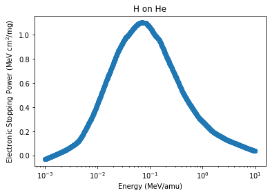
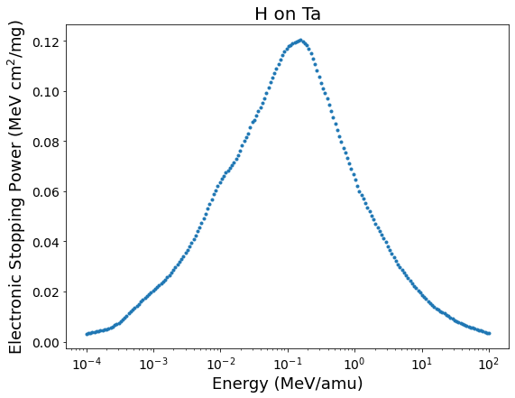

# SPNN - Stopping Power Neural Network

The SPNN is a python-based deep neural network that allows the user to predict the electronic stopping power cross-section for any ion and target[^1] combination for a wide range of incident energies. The deep neural network was trained with many tens of thousands curated data points from the [IAEA database](https://www-nds.iaea.org/stopping/). See more details of the SPNN in this [publication](arxiv).

[^1]: *SPNN first release considers only mono-atomic targets.*

 [](https://opensource.org/licenses/MIT) [](https://github.com/ale-mendez/SPNN/actions/workflows/spnn_ci.yml/badge.svg) [](http://codecov.io/github/ale-mendez/SPNN?branch=master) 
 <!-- [](http://depsy.org/package/python/) -->

### Citation

```
@article{BivortHaiek2022,
author = {F. Bivort Haiek, A. M. P. Mendez, C. C. Montanari, D. M. Mitnik},
title = {ESPNN: The IAEA stopping power database neutral network. Part I: Monoatomic targets.},
year = {2022}
}
```
## Getting started

To use the SPNN, we recommend using a python virtual environment. For example, [anaconda](https://docs.anaconda.com/anaconda/install/index.html) or [virtualenv](https://virtualenv.pypa.io/en/stable/installation.html). If you are not familiar with virtual environments and would like to rapidly start using python, follow the [anaconda](https://docs.anaconda.com/anaconda/install/index.html) indications according to your operating system:

- [Install anaconda in Linux](https://docs.anaconda.com/anaconda/install/linux/)
- [Install anaconda in Windows](https://docs.anaconda.com/anaconda/install/windows/)
- [Install anaconda in macOS](https://docs.anaconda.com/anaconda/install/mac-os/)

### Install SPNN

#### Using pip

The simplest way to install the SPNN is via pip. Indistinctively, Ubuntu and Windows users can download the package by typing in the terminal or the anaconda bash terminal:
```console
~$ pip install SPNN
```

#### Using this repository

You can also install the SPNN package by cloning or [downloading](https://github.com/ale-mendez/SPNN/archive/refs/heads/master.zip) this repository. To clone (make sure you have git installed) this repo, use the following commands in your terminal
```console
~$ git clone https://github.com/ale-mendez/SPNN.git
~$ cd SPNN
~$ pip install SPNN/
```
If you [downloaded](https://github.com/ale-mendez/SPNN/archive/refs/heads/master.zip) the zip, change your directory to your download folder and, in the terminal, use
```console
~$ pip install SPNN.zip
```

### Run SPNN in a notebook

A basic tutorial of the SPNN package usage is given in [prediction.ipynb](workflow/prediction.ipynb). The package requires the following parameters as minimal input:

- ``projectile``: Chemical formula for the projectile
- ``projectile_mass``: Mass in amu for the projectile
- ``target``: Chemical formula for the target
- ``target_mass``: Mass in amu for the target

```python
import SPNN
SPNN.run_SPNN(projectile='He', projectile_mass=4.002602, target='Au', target_mass=196.966569)
```
    


The package automatically produces ``matplotlib`` figure and a sample file named ``XY_prediction.dat``, where ``X`` is the name of the projectile and ``Y`` is the name of the target system.

```console
~$ ls -a
.  ..  HHe_prediction.dat  prediction.ipynb 
```

#### Optional arguments:

The energy grid used for the SPNN calculation can be customized with arguments

- ``emin``: Minimum energy value in MeV/amu units (default: ``0.001``)
- ``emax``: Maximum energy value in MeV/amu units (default: ``10``)
- ``npoints``: Number of grid points (default: ``1000``)

Furthermore, the figure plotting and output-file directory-path can be modified via
- ``plot``: Prediction plot (default: ``True``)
- ``outdir``: Path to output folder (default: ``"./"``)


```python
SPNN.run_SPNN(projectile='He', projectile_mass=4.002602, target='Au', target_mass=196.966569, emin=0.01, emax=1, npoints=50)
```


    

    


### Run SPNN from terminal

The SPNN package can also be used from terminal with a syntaxis analogous to the above given:

```console
~$ python -m SPNN He 4.002602 Au 196.966569
```

Additional information about the optional arguments input can be obtained with the -h, --help flag:

```console
~$ python -m SPNN -h
```


##  Funding Acknowledgements

The following institutions financially support this work: the Consejo Nacional de Investigaciones Científicas y Técnicas (CONICET) by the PICT-2020-SERIEA-01931 and the Agencia Nacional de Promoción Científica y Tecnológica (ANPCyT) of Argentina PIP-11220200102421CO. CCM also acknowledges the financial support of the IAEA.